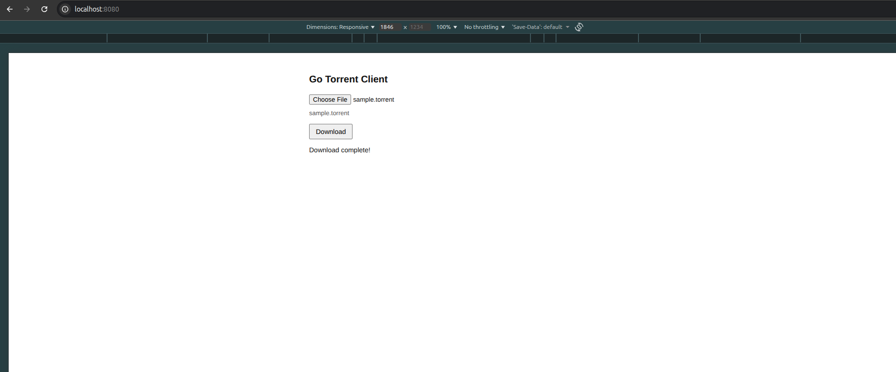

# Go Torrent

A minimal BitTorrent client written in Go. It discovers peers, downloads pieces, and verifies them against the torrent’s piece hashes.

## Features

- Bencode decoding and info-hash handling
- Tracker announce (peer discovery)
- Peer wire protocol: handshake, bitfield, interested, unchoke, piece requests
- **Web UI** — upload a `.torrent` file; the completed file is sent back to your browser as a download

## Requirements

- [Go](https://go.dev/dl/) 1.21+ (see `go.mod` for the exact toolchain)

## Run the web app

From the repository root:

```bash
./dev.sh
```



Open **http://localhost:8080**, choose a `.torrent` file, and click **Download**. When the transfer finishes, your browser saves the file (same behavior as a normal download).
